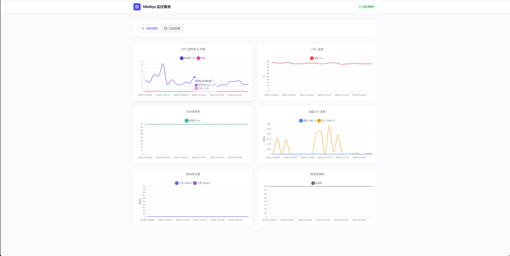
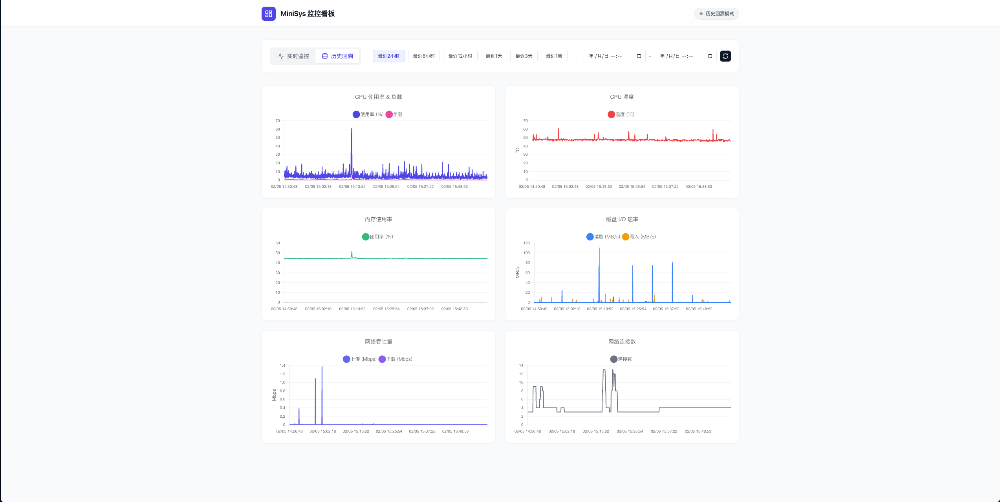

# MiniSys Dashboard (轻量级 NAS 监控面板)


> 本项目由 [Trae AI](https://www.trae.ai) 开发。
> 

一个专为 **NAS**、**迷你主机**（如 N100、树莓派等）和**低功耗服务器**设计的轻量级系统监控仪表板。

它采用 **Go + React** 编写，单体架构，资源占用极低（CPU < 1%，内存 < 50MB），支持秒级实时监控和 7 天历史数据回溯。

| 实时监控 (Realtime) | 历史回溯 (History) |
| ----------------- | ---------------- |
|  |  |

## ✨ 核心特性

*   **⚡️ 极致轻量**：后端采用 Go 编写，静态编译无依赖；前端 React 构建为静态资源，由 Go 服务统一分发。
*   **🔄 实时监控**：基于 SSE (Server-Sent Events) 技术，实现毫秒级数据推送，无 WebSocket 握手开销。
*   **📊 历史回溯**：内置轻量级 SQLite 数据库（启用 WAL 模式），支持查看最近 7 天的历史性能趋势。
*   **💾 磁盘友好**：智能内存缓冲机制，每 5 分钟批量写入一次数据库，**绝不唤醒休眠硬盘**，保护您的 NAS 硬盘。
*   **📈 丰富指标**：
    *   **CPU**: 使用率、负载、温度
    *   **内存**: 使用率、已用/总量
    *   **磁盘**: 实时读写速率 (IO)
    *   **网络**: 上行/下行速率、连接数
*   **📱 响应式设计**：完美适配桌面端和移动端浏览器。
*   **🐳 Docker 部署**：开箱即用。

## 🚀 快速开始 (Docker)

由于镜像尚未推送到 Docker Hub，您需要先在本地构建镜像。

### 1. 构建镜像

```bash
# 在项目根目录下运行
docker build -t minisys-dashboard:latest .
```

### 2. 启动容器

**使用 Docker CLI:**

```bash
docker run -d \
  --name minisys-dashboard \
  --restart unless-stopped \
  --network host \
  -v $(pwd)/data:/app/data \
  minisys-dashboard:latest
```

> **注意**：建议使用 `--network host` 模式以获取最准确的网络流量数据。如果无法使用 host 模式，也可以映射端口 `-p 8080:8080`。

**使用 Docker Compose:**

创建 `docker-compose.yml`：

```yaml
version: '3.8'
services:
  dashboard:
    image: minisys-dashboard:latest
    container_name: minisys-dashboard
    restart: unless-stopped
    network_mode: host
    volumes:
      - ./data:/app/data
    # 如果不使用 host 模式，取消注释以下端口映射
    # ports:
    #   - "8080:8080"
```

启动服务：
```bash
docker-compose up -d
```

访问浏览器：`http://localhost:8080`

## 🛠️ 手动构建

如果您想自己编译源码：

### 前置要求
*   Go 1.21+
*   Node.js 18+
*   Make (可选)

### 构建步骤

1.  **克隆项目**
    ```bash
    git clone https://github.com/yourusername/MiniSysDashboard.git
    cd MiniSysDashboard
    ```

2.  **构建前端**
    ```bash
    cd web
    npm install
    npm run build
    # 构建产物将生成在 web/dist 目录
    ```

3.  **构建后端**
    ```bash
    cd ../server
    # 将前端构建产物复制到后端静态目录（如果有此步骤需求，或后端已配置直接读取）
    # 编译 Go 二进制文件
    go build -ldflags="-s -w" -o minisys-dashboard ./cmd/server
    ```

4.  **运行**
    ```bash
    ./minisys-dashboard
    ```

## 📂 目录结构

```
.
├── Dockerfile              # 多阶段构建 Dockerfile
├── README.md               # 项目说明
├── server/                 # Go 后端源码
│   ├── cmd/                # 入口文件
│   ├── internal/           # 核心逻辑 (API, Collector, Storage)
│   └── data/               # 数据库存储目录 (自动生成)
└── web/                    # React 前端源码
    ├── src/                # 页面与组件
    └── public/             # 静态资源
```

## ⚙️ 配置说明

目前主要通过环境变量或默认配置运行：

*   **端口**: 默认为 `8080`
*   **数据存储**: 默认为 `./data/metrics.db`
*   **采集间隔**: 默认为 `1秒`
*   **数据保留**: 默认为 `7天`

## 📄 开源协议

本项目采用 [MIT 协议](LICENSE)。
